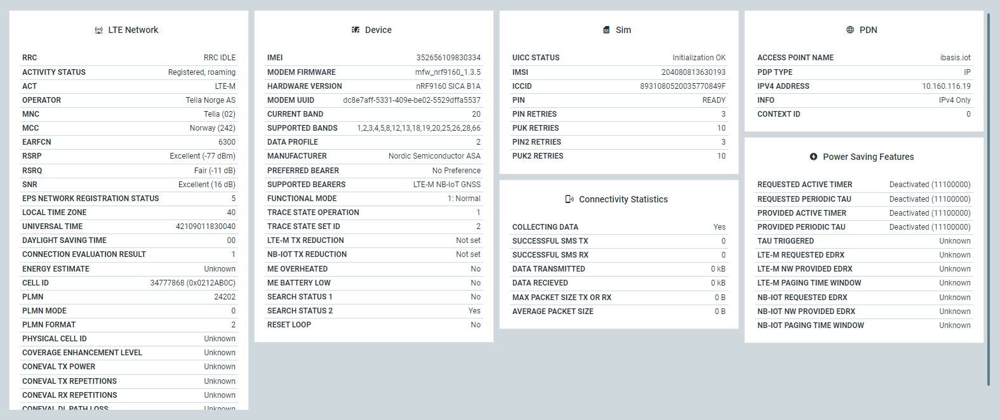

# Viewing a modem trace in the {{app_name}}

To play back and focus on a part of the trace, you can drag and scroll the **Packet Event Viewer**. The [**Connection Status**](./overview.md#connection-status) and [**Dashboard**](./overview.md#dashboard-tab) update accordingly and replay the selected events.

## Packet Event Viewer

The **Packet Event Viewer** visualizes communication at the AT command, Radio Resource Control (RRC), Non-access Stratum (NAS), and Internet Protocol (IP) levels.

By default, the events are equally spaced for readability. To view the timeline, switch to **Time** in **Packet Event Viewer settings**. You can also hide unwanted event layers here.

You can control the viewed trace data with the following options:

- To play back the trace, click on and drag the graph to the left.
- To extend or decrease the viewed trace events, scroll the graph.
- To view information on the AT commands and the event timestamp, hover over a specific event.
- To pause a live trace, click the live button.

## Dashboard

The dashboard contains detailed information about the connection and its components. During trace, dashboard fields are highlighted as they are populated. To view in slow motion, you can use the **Packet Event Viewer** to play back.

Hover over any of the fields to view a description of the field, including related AT commands and links to documentation. While capturing a trace, you can choose to run the AT commands from here.

The trace data is categorized into the following 6 dashboard panels:

- **LTE Network**
- **Device**
- **SIM**
- **Connectivity Statistics**
- **Power Saving Features**
- **PDN** (There can be more than one. A **PDN** panel is displayed for each network when a connection is established.)

